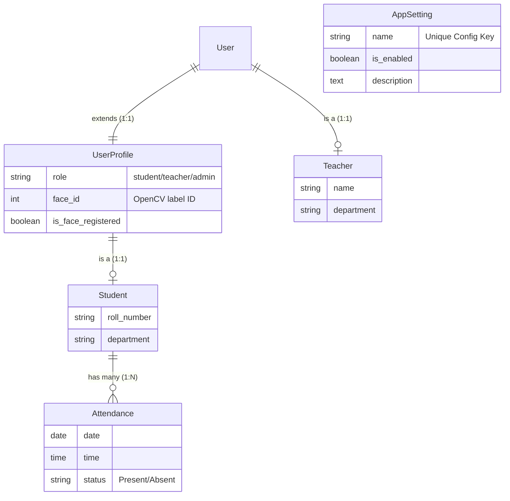

# SmartAttend: Facial Recognition Attendance System

## Executive Summary
**SmartAttend** is a Django-based web application that streamlines classroom attendance using biometric facial recognition. Instead of traditional roll calls, the system utilizes client-side webcams to capture video frames, which are streamed via Base64 to a backend OpenCV processor. The system matches faces against pre-trained LBPH (Local Binary Patterns Histograms) models and ensures liveness detection to prevent spoofing. It features a comprehensive role-based dashboard system for Students, Teachers, and Administrators.

---

## 🏗️ Technical Architecture & Stack
The project follows a Monolithic architecture under the Django MTV (Model-Template-View) pattern, enhanced with an asynchronous-like polling architecture for real-time video processing.

### Core Technologies
*   **Backend Framework:** Django 5 (Python)
*   **Database:** SQLite3 (development) 
*   **Computer Vision:** OpenCV (`cv2`) 
    *   **Face Detection:** Haar Cascade Classifiers (`haarcascade_frontalface_default.xml`, `haarcascade_eye.xml`)
    *   **Face Recognition:** Local Binary Patterns Histograms (`LBPHFaceRecognizer`)
*   **Frontend UI:** HTML5, Tailwind CSS (locally compiled), FontAwesome
*   **Video Streaming:** Client-side JavaScript `navigator.mediaDevices.getUserMedia()` capturing frames to `<canvas>` and sending as Base64 JSON payloads to the Django server.

---

## 🗄️ Database Schema & Models
The system uses Django's ORM mapped to the following core entities in [homepage/models.py](file:///d:/4th_sem_project/implementation/facial_attendance_11/facial_attendance/homepage/models.py). 

---

## 🚀 Key Features and Capabilities

### 1. Robust Role-Based Access Control (RBAC)
*   **Administrator Portal:** Can manage App Settings, register Students/Teachers, view global attendance metrics, and export mass reports.
*   **Teacher Panel:** Can view student rosters, start facial recognition scanning sessions for their classes, and manually edit/mark absences.
*   **Student Dashboard:** A self-service portal to view personal attendance history, see "classes missed" metrics, and download self-attendance PDF reports.

### 2. High-Security Authentication (2FA)
A major feature of this system is the integration of Biometric 2FA. When `require_face_login` is enabled in the App Settings, Teachers and Students must first enter their password, and then dynamically verify their identity through the webcam before session cookies are issued.

### 3. Anti-Spoofing & Liveness Detection
To prevent students from holding up a picture to the camera, the system incorporates **Eye-Blink Detection** via Haar Cascades (`haarcascade_eye.xml`). The [process_client_frame](file:///d:/4th_sem_project/implementation/facial_attendance_11/facial_attendance/homepage/views.py#54-165) backend view ensures that a face is only marked as definitively recognized if it is detected for 5 consecutive frames *and* a blink is detected. Confidences higher than `55` (stricter LBPH distance) are immediately rejected as `Unknown`.

### 4. Automated Reporting & Backfills
*   **PDF/CSV Generation:** Uses `reportlab` to generate on-the-fly PDF certificates of attendance, and Python's native [csv](file:///d:/4th_sem_project/implementation/facial_attendance_11/facial_attendance/homepage/views.py#1111-1136) module for spreadsheet exports.
*   **Absence Auto-Backfill:** The [backfill_absences()](file:///d:/4th_sem_project/implementation/facial_attendance_11/facial_attendance/homepage/views.py#279-323) hook runs upon dashboard launch. It calculates any days where a student did not scan in (from the system inception date to yesterday) and automatically inserts bulk `Absent` records to maintain data integrity.

### 5. Configurable "App Settings"
Admins can dynamically toggle global app features without touching code or `.env` files. These include:
*   `require_face_login`: Toggles camera 2FA.
*   `auto_mark_absent`: Toggles the background backfill process.
*   `allow_manual_attendance`: Toggles teacher override capabilities.
*   `student_pdf_export`: Enables/Disables the "Export PDF" button for students.

---

## 📂 Project Structure Overview

*   **`facial_attendance/`**: The root Django configuration (contains [settings.py](file:///d:/4th_sem_project/implementation/facial_attendance_11/facial_attendance/facial_attendance/settings.py), [urls.py](file:///d:/4th_sem_project/implementation/facial_attendance_11/facial_attendance/homepage/urls.py), and SQLite DB).
*   **`homepage/`**: The core application module.
    *   [views.py](file:///d:/4th_sem_project/implementation/facial_attendance_11/facial_attendance/homepage/views.py): Contains massive monolithic business logic (Authentication, Dashboard Routing, OpenCV frame processing).
    *   [models.py](file:///d:/4th_sem_project/implementation/facial_attendance_11/facial_attendance/homepage/models.py): Database entities.
    *   [urls.py](file:///d:/4th_sem_project/implementation/facial_attendance_11/facial_attendance/homepage/urls.py): App-level routing and API endpoints (`/process-client-frame/`).
*   **`templates/`**: The HTML presentation layer. 
    *   [base.html](file:///d:/4th_sem_project/implementation/facial_attendance_11/facial_attendance/templates/base.html): The structural shell featuring the Tailwind sidebar and dynamic top-nav.
    *   [dashboard/](file:///d:/4th_sem_project/implementation/facial_attendance_11/facial_attendance/homepage/views.py#352-363): Role-specific dashboard layouts.
    *   `management/`: Admin/Teacher views for rosters and manual overrides.
*   **`datasets/`**: Mediastore for grayscale 50-frame training photo dumps of newly registered users (`User.{id}.{count}.jpg`).
*   **[trainer/](file:///d:/4th_sem_project/implementation/facial_attendance_11/facial_attendance/homepage/views.py#940-966)**: Output directory for OpenCV's `trainer.yml` generated via LBPH computations.
*   **`staticfiles/`**: Dedicated offline bundle of Tailwind CSS to ensure the app works on slow or restricted networks without a CDN.
